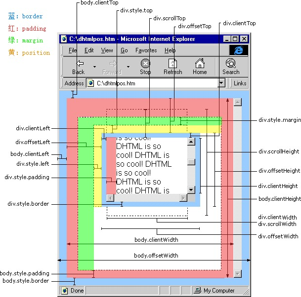

description  | attribute name
---|---
2|safasfa
2|safasfa

这里是javascript中建造迁移转变代码的常用属性

| description  | attribute name | 
| --|---| 
| 网页可见区域宽 | document.body.clientWidth(是对象可见的宽度，不包滚动条等边线，会随窗口的显示大小改变) | 
| 网页可见区域高 | document.body.clientHeight | 
| 网页可见区域宽 | document.body.offsetWidth(是对象的可见宽度，包滚动条等边线，会随窗口的显示大小改变) | 
| 网页可见区域高 |document.body.offsetHeight (包括边线的宽) | 
| 网页正文全文宽 |document.body.scrollWidth(是对象的实际内容的宽，不包边线宽度，会随对象中内容的多少改变--内容多了可能会改变对象的实际宽度) | 
| 网页正文全文高 |document.body.scrollHeight | 
| 网页被卷去的高 |document.body.scrollTop | 
| 网页被卷去的左 |document.body.scrollLeft | 
| 网页正文部分上 |window.screenTop | 
| 网页正文部分左 |window.screenLeft | 
| 屏幕分辨率的高 |window.screen.height | 
| 屏幕分辨率的宽 |window.screen.width | 
| 屏幕可用工作区高度 |window.screen.availHeight | 
| 屏幕可用工作区宽度 |window.screen.availWidth | 

HTML精确定位:scrollLeft,scrollWidth,clientWidth,offsetWidth

description  | attribute name   | 
--|---| 
scrollHeight | 获取对象的滚动高度| 
scrollLeft | 设置或获取位于对象左边界和窗口中目前可见内容的最左端之间的距离| 
scrollTop | 设置或获取位于对象最顶端和窗口中可见内容的最顶端之间的距离| 
scrollWidth | 获取对象的滚动宽度| 
offsetHeight | 获取对象相对于版面或由父坐标 offsetParent 属性指定的父坐标的高度| 
offsetLeft | 获取对象相对于版面或由 offsetParent 属性指定的父坐标的计算左侧位置| 
offsetTop | 获取对象相对于版面或由 offsetTop 属性指定的父坐标的计算顶端位置| 
event.clientX | 相对文档的水平座标| 
event.clientY | 相对文档的垂直座标| 
event.offsetX | 相对容器的水平坐标| 
event.offsetY | 相对容器的垂直坐标| 
document.documentElement.scrollTop | 垂直方向滚动的值| 
event.clientX+document.documentElement.scrollTop | 相对文档的水平座标+垂直方向滚动的量| 

**clientWidth、offsetWidth、clientHeight区别**

```javascript
//IE6.0、FF1.06+：
clientWidth = width + padding
clientHeight = height + padding
offsetWidth = width + padding + border
offsetHeight = height + padding + border
//IE5.0/5.5：
clientWidth = width - border
clientHeight = height - border
offsetWidth = width
offsetHeight = height
```

(需要提一下：CSS中的margin属性，与clientWidth、offsetWidth、clientHeight、offsetHeight均无关)


```css
div#banner  {  
 width:expression(window.screen.width - (border 边框) - (scroll width 滚动条宽度) );  
}  
```


### 1 offsetLeft

假设 obj 为某个 HTML 控件。

- obj.offsetTop 指 obj 间隔上方或上层控件的地位，整型，单位像素。
- obj.offsetLeft 指 obj 间隔左方或上层控件的地位，整型，单位像素。
- obj.offsetWidth 指 obj 控件自身的宽度，整型，单位像素。
- obj.offsetHeight 指 obj 控件自身的高度，整型，单位像素。

```html
<div id="tool">
<input type="button" value="提交">
<input type="button" value="重置">
</div>
```

- “提交”按钮的 offsetTop 指“提交”按钮距“tool”层上边框的间隔，因为距其上边比来的是 “tool” 层的上边框。
- “重置”按钮的 offsetTop 指“重置”按钮距“tool”层上边框的间隔，因为距其上边比来的是 “tool” 层的上边框。
- “提交”按钮的 offsetLeft 指“提交”按钮距“tool”层左边框的间隔，因为距其左边比来的是 “tool” 层的左边框。
- “重置”按钮的 offsetLeft 指“重置”按钮距“提交”按钮右边框的间隔，因为距其左边比来的是“提交”按钮的右边框。

以上属性在 FireFox 中也有效。

另 外：我们这里所说的是指 HTML 控件的属性值，并不是 document.body，document.body 的值在不合浏览器中有不合申明（实际上大多半景象是因为对 document.body 申明不合造成的，并不是因为对 offset 申明不合造成的），点击这里查看不合点。

### 2 offsetTop 与 style.top 的差别

筹办常识：offsetTop、offsetLeft、offsetWidth、offsetHeight

我们知道 offsetTop 可以获得 HTML 元素间隔上方或外层元素的地位，style.top 也是可以的，二者的差别是：

1. offsetTop 返回的是数字，而 style.top 返回的是字符串，除了数字外还带有单位：px
2. offsetTop 只读，而 style.top 可读写
3. 若是没有给 HTML 元素指定过 top 样式，则 style.top 返回的是空字符串

offsetLeft 与 style.left、offsetWidth 与 style.width、offsetHeight 与 style.height 也是同样事理。

### 3 clientHeight、offsetHeight和scrollHeight

我们这里说说四种浏览器对 document.body 的 clientHeight、offsetHeight 和 scrollHeight 的申明，这里说的是 document.body，若是是 HTML 控件，则又有不合，点击这里查看。

这四种浏览器分别为IE（Internet Explorer）、NS（Netscape）、Opera、FF（FireFox）。

2、clientHeight

- clientHeight: 大师对 clientHeight 都没有什么贰言，都认为是内容可视区域的高度，也就是说页面浏览器中可以看到内容的这个区域的高度，一般是最后一个对象条以下到状况栏以上的这个区域，与页面内容无关。
- offsetHeight
  - IE、Opera 认为 offsetHeight = clientHeight + 迁移转变条 + 边框。
  - NS、FF 认为 offsetHeight 是网页内容实际高度，可以小于 clientHeight。
- scrollHeight
  - IE、Opera 认为 scrollHeight 是网页内容实际高度，可以小于 clientHeight。
  - NS、FF 认为 scrollHeight 是网页内容高度，不过最小值是 clientHeight。
- clientHeight 就是透过浏览器看内容的这个区域高度。
  - NS、 FF 认为 offsetHeight 和 scrollHeight 都是网页内容高度，只不过当网页内容高度小于便是 clientHeight 时，scrollHeight 的值是 clientHeight，而 offsetHeight 可以小于 clientHeight。
  - IE、Opera 认为 offsetHeight 是可视区域 clientHeight 迁移转变条加边框。scrollHeight 则是网页内容实际高度。
- clientWidth、offsetWidth 和 scrollWidth 的申明与上方雷同，只是把高度换成宽度即可。
- FF 在不合的 DOCTYPE 中对 clientHeight 的申明不合， xhtml 1 trasitional 中则不是如上申明的。其它浏览器则不存在此题目。

3、scrollLeft

scrollTop 是“卷”起来的高度值，示例：

```html
<div style="width:100px;height:100px;background-color:＃FF0000;overflow:hidden;" id="p">
  <div style="width:50px;height:300px;background-color:＃0000FF;" id="t">若是为 p 设置了 scrollTop，这些内容可能不会完全显示。</div>
</div>
<script type="text/javascript">
  var p = document.getElementById（"p"）;
  p.scrollTop = 10;
</script>
```

因为为外层元素 p 设置了 scrollTop，所以内层元素会向上卷。scrollLeft 也是类似事理。

我们已经知道 offsetHeight 是自身元素的宽度。而 scrollHeight 是内部元素的绝对宽度，包含内部元素的隐蔽的项目组。

上述中 p 的 scrollHeight 为 300，而 p 的 offsetHeight 为 100。scrollWidth 也是类似事理。

IE 和 FireFox 周全支撑，而 Netscape 和 Opera 不支撑 scrollTop、scrollLeft（document.body 除外）。


### offsetTop、offsetLeft、offsetWidth、offsetHeight

4、clientLeft

返回对象的offsetLeft属性值和到当前窗口左边的真实值之间的间隔，可以懂得为边框的长度

一向以来对offsetLeft，offsetTop，scrollLeft，scrollTop这几个办法很含混，花了一天的时候好好的进修了一下．得出了以下的成果：

1.offsetTop     :

当前对象到其上级层顶部的间隔.不克不及对其进行赋值.设置对象到页面顶部的间隔请用style.top属性.

2.offsetLeft :

当前对象到其上级层左边的间隔.不克不及对其进行赋值.设置对象到页面左部的间隔请用style.left属性.

3.offsetWidth :

当前对象的宽度.与style.width属性的差别在于:如对象的宽度设定值为百分比宽度，则无论页面变大还是变小，style.width都返回此百分比，而offsetWidth则返回在不合页面中对象的宽度值而不是百分比值

4.offsetHeight :

与style.height属性的差别在于:如对象的宽度设定值为百分比高度，则无论页面变大还是变小，style.height都返回此百分比，而offsetHeight则返回在不合页面中对象的高度值而不是百分比值

5.offsetParent   :

当前对象的上级层对象.

重视.若是对象是包含在一个DIV中时，此DIV不会被当做是此对象的上级层，（即对象的上级层会跳过DIV对象）上级层是Table时则不会有题目.

哄骗这个属性，可以获得当前对象在不合大小的页面中的绝对地位．获得绝对地位脚本代码

```javascript
function GetPosition(obj){
  var left = 0;
  var top   = 0;
  while（obj != document.body）{
    left = obj.offsetLeft;
    top   = obj.offsetTop;
    obj = obj.offsetParent;
}
alert（"Left Is : " + left + "\r\n" + "Top   Is : " + top）;
}
```

6.scrollLeft :

对象的最左边到对象在当前窗口显示的局限内的左边的间隔．便是在呈现了横向迁移转变条的景象下，迁移转变条拉动的间隔．

7.scrollTop

对象的最顶部到对象在当前窗口显示的局限内的顶边的间隔． 便是在呈现了纵向迁移转变条的景象下，迁移转变条拉动的间隔．

### 这四种浏览器分别为IE（Internet Explorer）、NS（Netscape）、Opera、FF（FireFox）--- 这里说的是 document.body，若是是 HTML 控件，则又有不合

- clientHeight: 都认为是内容可视区域的高度，也就是说页面浏览器中可以看到内容的这个区域的高度，一般是最后一个对象条以下到状况栏以上的这个区域，与页面内容无关。
- offsetHeight
  - IE、Opera 认为 offsetHeight = clientHeight + 迁移转变条 + 边框
  - NS、FF 认为 offsetHeight 是网页内容实际高度，可以小于 clientHeight
- scrollHeight
  - IE、Opera 认为 scrollHeight 是网页内容实际高度，可以小于 clientHeight
  - NS、FF 认为 scrollHeight 是网页内容高度，不过最小值是 clientHeight
- clientHeight 就是透过浏览器看内容的这个区域高度。
  - NS、 FF 认为 offsetHeight 和 scrollHeight 都是网页内容高度，只不过当网页内容高度小于便是 clientHeight 时，scrollHeight 的值是 clientHeight，而 offsetHeight 可以小于 clientHeight。
  - IE、Opera 认为 offsetHeight 是可视区域 clientHeight 迁移转变条加边框。scrollHeight 则是网页内容实际高度。
- 同理, clientWidth、offsetWidth 和 scrollWidth 的申明与上方雷同，只是把高度换成宽度即可。


```javascript
//自适应案例
$(window).resize(function(){
  $('.className').css({  
    left: ($(window).width() - $('.className').outerWidth())/2,
    top: ($(window).height() - $('.className').outerHeight())/2 + $(document).scrollTop()
  });
});
//初始化函数
$(window).resize();
此外在页面载入时，就需要调用resize()。
$(function(){
    $(window).resize();
});
```

> Reference

[html中offsetTop、clientTop、scrollTop、offsetTop各属性介绍](http://blog.csdn.net/fswan/article/details/17238933)
