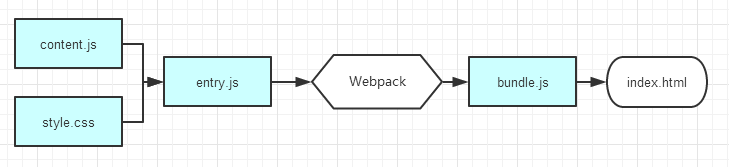
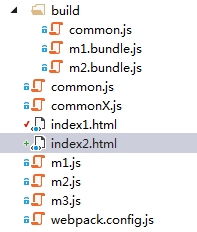
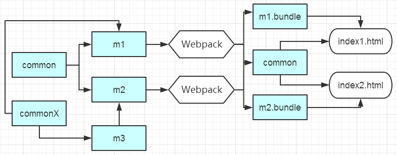

## 1 模块化

**所有资源都是模块**

Webpack处理后，输出的静态文件只剩下js与png，而css、less、jade其他的文件都合并到了js中。在Webpack当中，所有资源的都是模块，模块都需要通过AMD或者CMD规范加载，就像css样式文件，不再在HTML中以<link>标签加载。



**代码切分**

- 切分点（split point）: 切分点定义中依赖的所有模块，合起来就是一个代码块。说白了就是，一个页面引用一个代码块
- 代码块（Chunk）




```javascript
var path = require("path");
var CommonsChunkPlugin = require("../../node_modules/webpack/lib/optimize/CommonsChunkPlugin");
module.exports = {
    entry: {
        m1: './m1.js',
        m2: './m2.js'
    },
    output: {
        path: "build",
        filename: '[name].bundle.js'
    },
    plugins: [
        new CommonsChunkPlugin('common.js')
    ]
};
```

## 2 webpack.config.js配置说明

```javascript
var webpack = require('webpack');
//插件项, 这里使用了CommonsChunkPlugin 的插件，它用于提取多个入口文件的公共脚本部分，然后生成一个common.js 来方便多页面之间进行复用
var commonsPlugin = new webpack.optimize.CommonsChunkPlugin('common.js');
module.exports = {
    //引用插件
    plugins: [new CommonsChunkPlugin('common.js')],
    //页面入口文件配置
    entry: {
        index : './src/js/page/index.js',
	//支持数组形式，将加载数组中的所有模块，但以最后一个模块作为输出
        page2: ["./entry1", "./entry2"]
    },
    //入口文件输出配置
    output: {
        path: 'dist/js/page',
        filename: '[name].bundle.js'
    },
    module: {
        //加载器配置
        loaders: [
            { test: /\.css$/, loader: 'style-loader!css-loader' },  //.css 文件使用 style-loader 和 css-loader 来处理
            { test: /\.js$/, loader: 'jsx-loader?harmony' },  //.js 文件使用 jsx-loader 来编译处理
            { test: /\.scss$/, loader: 'style!css!sass?sourceMap'}, //.scss 文件使用 style-loader、css-loader 和 sass-loader 来编译处理， “!”是链接器，链接各个加载器及文件
            { test: /\.(png|jpg)$/, loader: 'url-loader?limit=8192'}  //图片文件使用 url-loader 来处理，小于8kb的直接转为base64
        ]
    },
    //其它解决方案配置
    resolve: {
        root: 'E:/github/flux-example/src', //绝对路径, 查找module的话从这里开始查找
        extensions: ['', '.js', '.json', '.scss'],
        alias: {
            AppStore : 'js/stores/AppStores.js',  //后续直接 require('AppStore') 即可
            ActionType : 'js/actions/ActionType.js',
            AppAction : 'js/actions/AppAction.js'
        }
    }
};
```

- 可以点[这里](http://webpack.github.io/docs/list-of-loaders.html)查阅全部的 loader 列表
- 关于 webpack.config.js 更详尽的配置可以参考[这里](http://webpack.github.io/docs/configuration.html)。

## 3 运行 webpack

```javascript
webpack --config XXX.js   //使用另一份配置文件（比如webpack.config2.js）来打包
webpack --watch   //监听变动并自动打包, 实时刷新, webpack 提供了 webpack-dev-server 解决实时刷新页面的问题，同时解决实时构建的问题
webpack -p    //压缩混淆脚本，这个非常非常重要！
webpack -d    //生成map映射文件，告知哪些模块被最终打包到哪里了
webpack --display-error-details  //方便出错时能查阅更详尽的信息（比如 webpack 寻找模块的过程）
```

事情是按以下顺序发生的，

1. js 文件修改
2. webpack-dev-server 监控到变化
3. webpack 在内存中重新构建 bundle.js
4. webpack-dev-server 保证页面引用的 bundle.js 文件与内存中一致

webpack-dev-server 提供了两种模式用于自动刷新页面：

**iframe 模式**

访问 http://localhost:8080/webpack-dev-server/index.html

**inline 模式**

在命令行中指定该模式，webpack-dev-server --inline。这样 http://localhost:8080/index.html 页面就会在 js 文件变化后自动刷新了。

以上说的两个页面自动刷新的模式都是指刷新整个页面，相当于点击了浏览器的刷新按钮。

## 4 补充

### 4.1  独立打包样式文件

希望项目的样式能不要被打包到脚本中，而是独立出来作为.css，然后在页面中以<link>标签引入, 需要 extract-text-webpack-plugin

```javascript
var webpack = require('webpack');
var commonsPlugin = new webpack.optimize.CommonsChunkPlugin('common.js');
var ExtractTextPlugin = require("extract-text-webpack-plugin");

module.exports = {
   plugins: [commonsPlugin, new ExtractTextPlugin("[name].css")],
   entry: {
        ...
```

### 4.2 与 grunt/gulp 配合

```javascript
gulp.task("webpack", function(callback) {
    webpack({
    }, function(err, stats) {
        if(err) throw new gutil.PluginError("webpack", err);
        gutil.log("[webpack]", stats.toString({
            // output options
        }));
        callback();
    });
});
```

更多参照信息请参阅：[grunt配置](http://webpack.github.io/docs/usage-with-grunt.html) / [gulp配置](http://webpack.github.io/docs/usage-with-gulp.html)

### 4.3 版本控制(hash缓存)

对于静态资源的版本控制，目前微信项目采取办法是版本号作为请求参数，版本号为发布日期，但有两个问题：

1. 更新版本时，CDN不能及时更新；
2. 没有发生变更的文件也被赋上新版本

Webpack的做法是，生成hash，区分文件, 参考[LONG TERM CACHING](http://webpack.github.io/docs/long-term-caching.html)

```javascript
//所有代码块添加hash
module.exports = {
    entry: "./entry.js",
    output: {
        //path: "assets/[hash]/",
        path: path.join(__dirname, "assets", "[hash]"),
        publicPath: "assets/[hash]/",
        filename: "bundle.js"
    }
};
//单个代码块添加hash, One hash per chunk
module.exports = {
    entry: "./entry.js",
    output: {
        path: "build/",
        publicPath: "build/",
        chunkFilename: "[id].[hash].bundle.js",
        filename: "output.[hash].bundle.js",
    }
};
```


有许多第三方库的代码，基本不会修改，比如 react、react-router 或 jQuery，这些代码，在部署的时候，可以打包成一个 vendor.[chunkhash].js 文件，这样用户第一次访问需要下载，第二次访问就可以读取浏览器缓存。

```javascript
module.exports = {
  entry: {
    app: [
      './script/app'
    ],
    vendor: ['react', 'react-router', 'jquery']
  },
  output: {
    path: path.join( __dirname, '/dist' ),
    filename: '[name].[chunkhash].js'
  },
  plugins: [ new webpack.optimize.CommonChunkPlugin({ name: 'vendor' }) ]
  //运行 webpack 命令打包后，会生成 vendors.46b0ed9caf9a53733d60.js 这样的文件名，只要文件内容不变，chunkhash 部分就不会变，而文件内容一旦变化，chunkhash 就会变化。于是我们合理利用了浏览器的缓存功能，同时也保证缓存能够及时更新
}
```

### 4.4 不同的common模块

CommonsChunkPlugin插件来提取多个页面之间的公共模块，并将该模块打包为common.js, 有时候我们希望能更加个性化一些，可以这样配置

```javascript
var CommonsChunkPlugin = require("webpack/lib/optimize/CommonsChunkPlugin");
module.exports = {
    entry: {
        p1: "./page1",
        p2: "./page2",
        p3: "./page3",
        ap1: "./admin/page1",
        ap2: "./admin/page2"
    },
    output: {
        filename: "[name].js"
    },
    plugins: [
        new CommonsChunkPlugin("admin-commons.js", ["ap1", "ap2"]),
        new CommonsChunkPlugin("commons.js", ["p1", "p2", "admin-commons.js"])
    ]
};
// <script>s required:
// page1.html: commons.js, p1.js
// page2.html: commons.js, p2.js
// page3.html: p3.js
// admin-page1.html: commons.js, admin-commons.js, ap1.js
// admin-page2.html: commons.js, admin-commons.js, ap2.js
```

### 4.5 使用CDN/远程文件

有时候希望某些模块走CDN并以`<script>`的形式挂载到页面上来加载，但又希望能在`webpack`的模块中使用上。这时候可以在配置文件里使用`externals`属性


```javascript
  externals: {
        // require("jquery") 是引用自外部模块的
        // 对应全局变量 jQuery, 得确保 CDN 文件必须在 webpack 打包文件引入之前先引入。
        "jquery": "jQuery"
    }
```

> references

- [Setting up React for ES6 with Webpack and Babel](https://www.twilio.com/blog/2015/08/setting-up-react-for-es6-with-webpack-and-babel-2.html)
- [一小时包教会 —— webpack 入门指南](http://www.cnblogs.com/vajoy/p/4650467.html)
- [webpack入门指谜](http://segmentfault.com/a/1190000002551952)
- [webpack 使用教程](https://www.zfanw.com/blog/webpack-tutorial.html)
- [webpack Samples](https://github.com/zero1036/TGWebS/tree/dev/TGWebS/nodeJS/webpack)
