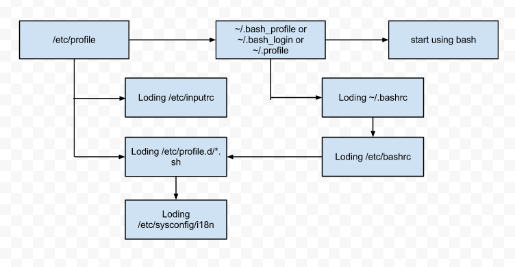

**Linux bash入门**

## bash的登录与欢迎信息

- /etc/issue 文件： 记录了bash登录前的欢迎信息，相关信息可以用`man issue`查看
- /etc/motd 文件： 记录了bash登录成功后的欢迎信息

## bash的环境配置文件

- login shell: 在输入帐号密码登录的时候取得的bash，例如从tty1-tty6登录
- non-login shell: 取得bash不需要完整的登录流程，例如在图形界面开启Terminal

Login Shell读取配置文件流程



而非登录shell仅仅会读取 ~/.bashrc

## 语法结构

功能|说明
---|---
赋值语句|var=value
变量解析|${var}
命令解析|${command}
双引号 " "|变量内容，并做转义
单引号 ' '|变量内容，但不做转义
反单引号 ` `|同 $()

**通配符(wildcard)**

功能|说明
---|---
`*`|代表任意个任意字符
`?`|代表1个任意字符
`[abc]`|代表a或b或c中的一个
`[a-z]`|代表 a～z这个范围
`[^abc]`|代表除了a或b或c以外的字符

**数据流重定向**

功能|说明
---|---
`0`|STDIN 标准输入
`1`|STDOUT 标准输出
`2`|STDERR 标准错误输出
`>, >>`|输出流重定向， `>`为覆盖，`>>`为追加
`<`|输入重定向
`<<`|eof符号
`；`|顺序执行
`&&`|且， `cmdA && cmdB`, 只有cmdA成功了才会继续执行cmdB，成功的依据就是 $? 这个状态回传码

`||`|或逻辑， `cmdA||cmdB` 只有cmdA执行失败才会继续执行cmdB


**环境变量**

功能|说明
---|---
`$OSTYPE`|操作系统类型
`$HOSTTYPE`|主机默认安装的软件主要类型，32位的有 i386, i586, i686， 64位为 x86_64
`$MACHTYPE`|安装的机器类型
`$$`|当前shell的PID
`$?`|上一个命令的返回值，如果上一个命令执行成功则返回0

**read, array, declare**

功能|说明|代码
---|---|---
read|读取用户输入到某个变量|`read -p "Please enter your name: " name`
array|bash数组的赋值与输出|
declare|声明变量类型|
1)|`declare -x name`|将 name 变成环境变量
2)|`declare +x name`|将 name 恢复成自定义变量
3)|`declare -i product=10*10`|将product定义成整形，这样后面的表达式就会得到计算
4)|`declare -r name`|将 name 定义成只读变量
5)|`declare -a product`|将 product 定义成数组类型
6)|`declare -p product`|查看 product 的类型信息

**管道(pipe)**

管道可以将前一个命令的stdout当作后一个命令的stdin，只有特定的管道命令才能使用, 管道命令有 cut,grep,sort,wc,uniq,tee,tr,col,join,paste,expand等

- `-`号:  可以代替 STDOUT STDIN

`tar -czv -f - /home | tar -xzv -f -`

第一个`-`代替stdout，第二个`-`代替stdin，想当于用tar来实现cp

**语句**

- 条件判断语句:  if ... elif ... then ... fi

```shell
#!/bin/bash
# 使用 if then else fi 获取端口状态
testing=$(netstat -tualn | grep ":80")
if [ "$testing" != "" ]; then
    echo "WWW port 80 is running in your system"
fi
testing=$(netstat -tualn | grep ":21")
if [ "$testing" != "" ]; then
    echo "FTP port 21 is running in your system"
fi
testing=$(netstat -tualn | grep ":22")
if [ "$testing" != "" ]; then
    echo "SSH port 22 is running in your system"
fi
testing=$(netstat -tualn | grep ":25")
if [ "$testing" != "" ]; then
    echo "MAIL port 25 is running in your system"
fi
```

- 选择语句: case ... esac 

```shell
#!/bin/bash
#test case ... esac
echo "Exit system?"
echo "1.yes 2.no"
read -p "Enter your choice: " choice
case $choice in
    "1")
        echo "Exit now"
        ;;
    "2")
        echo "Not exit"
        ;;
    *)
        echo "Plase enter 1 or 2"
        ;;
esac
```

- function函数

```shell
#!/bin/bash
#use function()
function printit() {
    echo "$0 Printing $1"
}
printit "myparam"
```

- while 循环

```shell
#!/bin/bash
# test while loop
while [ "$yn" != "yes" -a "$yn" != "no" ]
do
    read -p "Please input yes/no: " yn
done
echo "Good!"

i=0
s=0
while [ "$i" -lt 100 ]
do
    i=$(($i+1))
    s=$(($s+$i))
done
echo "The sum is $s"
```

- for的用法

1.使用 for ... in ... do ... done 

```shell
#!/bin/bash
# test for ... in ... do ... done
# 查看子网是否联通
ip="192.168.1"
for sitenu in $(seq 1 100)
do
    ping -c 1 -w 1 "${ip}.${sitenu}" &> /dev/null && result=1 || result=0
    if [ "$result" == 1 ]; then
        echo "${ip}.${sitenu} is ON"
    else
        echo "${ip}.${sitenu} is DOWN"
    fi
done
```

```shell
#!/bin/bash
#查看目录下所有文件权限
read -p "Enter a directory: " dir

if [ "$dir" == "" -o ! -d "$dir" ]; then
    echo "The $dir is NOT exist in your system."
    exit 1
fi

filelist=$(ls $dir)
for filename in $filelist
do
    perm=""
    test -r "$dir/$filename" & perm="$perm readable"
    test -w "$dir/$filename" & perm="$perm writable"
    test -x "$dir/$filename" & perm="$perm executable"
    echo "The file $filename's permission is $perm"
done
```

2. 使用 `for (())` 语法

```shell
#!/bin/bash
# test for
if [ $# != 1 ]; then
    echo "Usage $0 {maxnum}"
    exit 1;
fi
s=0
for (( i=1; i<=$1; i++ ))
do
    s=$(($s+$i))
done
echo "The sum of 1+2+3..+$1 is $s"
```

```shell
#!/bin/bash　　#表明该脚本使用sh或bash
#This is a sample
#usage of variable
year=1999;　　#变量赋值语句
#usage of expression
year=`expr $year + 1`;　　#变量运算,使用expr或let
echo $year
year="olympic'"$year　　#字符串直接连接,不需要连接符
echo $year

#usage of if statement　　
if [ $year = 1999 ]
then
echo "greate"
else
echo "not greate"
fi　　#语句使用相反的单词结束

#usage of function and local variable
function echoyear {
    local year=1998;　　#局部变量使用local修饰
    echo $year
}
echo $year;
echoyear;　　#函数调用

#usage of for loop
for day in Sun Mon Tue Ooo　　#for语句,day为循环变量,in后面的是循环内容
do
echo $day
done

# usage of while loop and array
users=(Jim Liu Dick Jack Rose)　　#数组赋值
i=0
while [ ! -z ${users[$i]} ]　　#数组取值使用${users[$i]}
do
echo ${users[$i]}
i=`expr $i + 1`
done

# usage of util
var="I'm not empty"
until [ -z "$var" ];do #字符串变量需要用双引号括起,否则会抛出"too many argumet"异常,因为脚本会认为每个空格隔开的字符串都是一个参数47
echo $var
var=
done

# usage of case and input from keyboard
echo "Hit a key, then press return" 
read Keypress　　#从键盘读入输入

case "$Keypress" in　　#使用case语句
[a-z]) echo "Lowercase letter";;　　#选择符可以使用正则匹配
[A-Z]) echo "Uppercase letter";;
[0-9]) echo "Digit";;
*) echo "Other";;
esac

# usage of function
function pow() {　　#函数参数使用$1, $2表示第一个参数和第二个参数,以此类推
    local res=`expr $1 \* $1` # use \* instead of * here
    return $res
}
param=5
pow $param　　#函数传参
result=$?　　#$?代表函数返回值,$#代表参数个数,$@代表所有参数集合
echo $result

# usage of random digit
a=$RANDOM　　#随机数的使用
echo $a

# usage of select
OPTIONS="Hello Quit"
select opt in $OPTIONS　　$使用select自动产生选项供用户选择
do
    case $opt in
        "Hello") 
            echo "Hello There"
            ;;
        "Quit") 
            echo "Done"
            ;; 
        *) 
            echo "Bad Option"
               ;;
    esac
done

# usage of read
echo "Insert your name";
read name　　#键盘输入数据
echo "Hi "$name
```

http://www.cnblogs.com/zemliu/archive/2012/05/13/2497784.html

