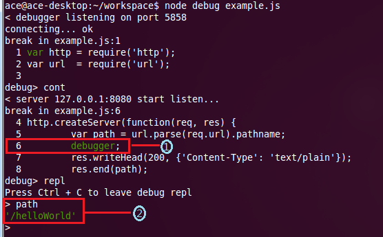
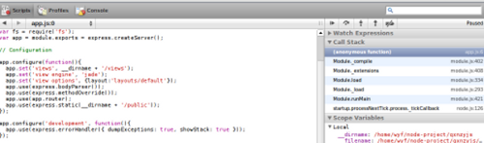

## 1. 基于Nodejs内建的调试器

```JavaScript
var path = url.parse(req.url).pathname;
debugger;
res.writeHead(200, {'Content-Type': 'text/plain'});
```

执行命令：`node debug example.js` 就可以进入调试模式



## 2. 基于Chrome浏览器的调试器

`npm install -g node-inspector`

node-inspector是通过websocket方式来转向debug输入输出的。因此，我们在调试前要先启动node-inspector来监听Nodejs的debug调试端口, 在启动node-inpspector之后，可以通过--debug或--debug-brk来启动nodejs程序

默认情况下node-inspector的端口是8080，可以通过参数--web-port=[port]来设置端口

在浏览器输入`http://[ip address]:8080/debug?port=5858`，会得到调试窗口



> reference:  http://www.cnblogs.com/moonz-wu/archive/2012/01/15/2322120.html
